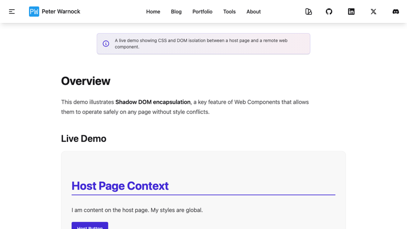

Today I expanded the site's component library with three distinct demos, each
targeting a specific capability of modern Web Components: strict style
isolation, lightweight 3D rendering, and intelligent iframe management.

To ensure these components remain stable and visually consistent, I also
integrated them into my **Playwright** visual regression testing suite.

## 1. Shadow DOM Isolation

One of the strongest selling points of Web Components is the **Shadow DOM**—a
mechanism that encapsulates a component's HTML and CSS, protecting it from the
global styles of the host page.

I built a [Isolation Demo](/components/isolation-demo/) to prove this concept.
The demo simulates a "Remote Component" (loaded via script) placed inside a Host
Page.

- **The Host Page** has aggressive global styles (e.g., `h2 { color: blue }`).
- **The Component** has its own conflicting styles (e.g.,
  `h2 { color: orange }`).

Thanks to the Shadow DOM, the styles do not bleed in or out. This architecture
is critical for building embeddable widgets or micro-frontends where you cannot
control the host environment.



## 2. Lit 3D Piano

[The Piano Demo](/components/piano-demo/) explores the fun side of the web
platform. Instead of reaching for heavy 3D libraries like Three.js, this
component uses **CSS 3D Transforms** to render a playable piano keyboard.

- **Lightweight**: Zero heavy dependencies; just Lit for state and standard CSS
  for visuals.
- **Interactive**: Uses the Web Audio API to generate sound on the fly.
- **Responsive**: CSS transforms handle the perspective and rotation natively.

This demo was adapted from an open-source experiment by Rody Davis,
demonstrating how easily existing web platform code can be wrapped and reused as
a standard HTML element `<lit-3d-piano>`.


## 3. Smart Iframe & Tech Radar

Embedding external content (like my
[Tech Radar](https://peterwarnock.com/build-your-own-radar/)) often comes with
trade-offs in performance, security, and UX. To solve this, I built a
`<smart-iframe>` wrapper.

Check out the [Smart Iframe Demo](/components/iframe-demo/).

**Key Features:**

- **Loading States**: Shows a spinner until the iframe content is ready,
  preventing the "white box" flash.
- **Security Defaults**: Applies strict `sandbox` attributes by default.
- **Breakout Layout**: Includes logic to "break out" of the parent container and
  span the full viewport width, essential for complex tools like the Radar.
- **Dev Tools**: Includes a `dev-crop` attribute to visually trim
  headers/footers from the embedded content if cross-origin policies allow (or
  if using same-origin embeds).


## Verified with Visual Regression

Building these components is only half the battle. Ensuring they render
correctly across different browsers and responsive breakpoints is where
**Playwright** comes in.

I updated the `tests/visual-regression.spec.ts` suite to visit each new demo
page and capture a snapshot.

```typescript
test('isolation demo page visual regression @visual', async ({ page }) => {
  await page.goto('/components/isolation-demo/');
  await page.waitForLoadState('networkidle');
  await expect(page).toHaveScreenshot('isolation-demo-page.png');
});
```

This ensures that if I accidentally break the CSS isolation or the 3D transforms
in a future update, the CI pipeline will catch the visual difference
immediately.
