# Release Management

This document outlines the release management process for the Peter Warnock
portfolio website, ensuring consistent, reliable deployments with proper
versioning and rollback capabilities.

## Overview

The release management process follows semantic versioning with automated CI/CD
pipelines through GitHub Actions. Each release is tagged, documented, and
deployed to GitHub Pages with comprehensive testing and validation.

## CI/CD Workflow Architecture

```mermaid
graph TB
    %% Trigger Events
    Push[Push to main] --> CI[CI/CD Pipeline]
    PR[Pull Request] --> Test[Test Workflow]
    Push --> Coverage[Coverage Workflow]
    Push --> PathBuild[Path-Based Builds]

    %% CI/CD Pipeline
    subgraph "CI/CD Pipeline"
        CI_Build[Build & Lint]
        CI_Quality[Code Quality Scan]
        CI_TestBuild[Test Build]
        CI_GA[GA Tracking Test]
        CI_Artifact[Upload Pages Artifact]

        CI_Build --> CI_Quality
        CI_Quality --> CI_TestBuild
        CI_TestBuild --> CI_GA
        CI_GA --> CI_Artifact
    end

    %% Test Workflow
    subgraph "Test Workflow"
        Test_Build[Hugo Build Test]
        Test_Links[Link Validation]
        Test_E2E[E2E Playwright Tests]
        Test_Report[Upload Test Report]

        Test_Build --> Test_Links
        Test_Links --> Test_E2E
        Test_E2E --> Test_Report
    end

    %% Coverage Workflow
    subgraph "Coverage Workflow"
        Cov_Setup[Go Setup & Cache]
        Cov_Deps[Install Dependencies]
        Cov_Run[Run Tests with Coverage]
        Cov_Codecov[Upload to Codecov]
        Cov_Artifact[Upload Coverage Artifacts]

        Cov_Setup --> Cov_Deps
        Cov_Deps --> Cov_Run
        Cov_Run --> Cov_Codecov
        Cov_Codecov --> Cov_Artifact
    end

    %% Path-Based Builds
    subgraph "Path-Based Builds"
        Path_Detect[Detect Changes]
        Path_Content[Content Build]
        Path_Infra[Infrastructure Build]
        Path_Docs[Documentation Build]
        Path_Summary[Build Summary]

        Path_Detect --> Path_Content
        Path_Detect --> Path_Infra
        Path_Detect --> Path_Docs
        Path_Content --> Path_Summary
        Path_Infra --> Path_Summary
        Path_Docs --> Path_Summary
    end

    %% Workflow Completion Triggers
    Test --> WorkflowComplete[All Workflows Complete]
    Coverage --> WorkflowComplete
    PathBuild --> WorkflowComplete
    CI --> WorkflowComplete

    %% Deployment
    WorkflowComplete --> Deploy[Deploy to GitHub Pages]
    Deploy --> Live[Site Live]

    %% Guardrails
    Guardrail[Pre-Push Guardrail] --> Deploy
    Guardrail -.->|Manual Confirmation| Deploy

    %% Styling
    classDef trigger fill:#e1f5fe
    classDef pipeline fill:#f3e5f5
    classDef test fill:#e8f5e8
    classDef coverage fill:#fff3e0
    classDef deploy fill:#ffebee
    classDef guard fill:#fce4ec

    class Push,PR trigger
    class CI_Build,CI_Quality,CI_TestBuild,CI_GA,CI_Artifact pipeline
    class Test_Build,Test_Links,Test_E2E,Test_Report test
    class Cov_Setup,Cov_Deps,Cov_Run,Cov_Codecov,Cov_Artifact coverage
    class Deploy,Live deploy
    class Guardrail guard
```



### Workflow Dependencies

The deployment process ensures **all validation workflows complete
successfully** before deploying to production:

1. **CI/CD Pipeline** - Core build, linting, and quality checks
2. **Test Workflow** - Hugo build validation, link checking, E2E tests
3. **Coverage Workflow** - Go test coverage analysis and reporting
4. **Path-Based Builds** - Smart build strategy based on change types

Only when **all four workflows pass** does the deployment trigger, ensuring
comprehensive validation before production release.

## Bun-Specific CI/CD Considerations

### Dependency Management

- Use `bun install --frozen-lockfile` for reproducible builds
- Bun lockfile (`bun.lock`) replaces package-lock.json
- No global package installs in CI/CD for better reproducibility

### Performance Benefits

- **Installation Speed**: 3-5x faster than npm ci (legacy)
- **Disk Usage**: Reduced node_modules footprint
- **TypeScript**: First-class support with faster compilation
- **Caching**: Bun's global cache reduces CI/CD build times

## Versioning Strategy

### Semantic Versioning

We follow `MAJOR.MINOR.PATCH` semantic versioning:

- **MAJOR**: Breaking changes, major redesigns, technology stack changes
- **MINOR**: New features, significant content additions, UI improvements
- **PATCH**: Bug fixes, content updates, minor improvements

### Version Naming Convention

Versions use descriptive names for better tracking:

```
v[major.minor.patch]-[descriptive-name]
```

Examples:

- `v0.8.2-tailwind-v4-upgrade`
- `v0.9.0-design-system-overhaul`
- `v1.0.0-production-launch`

### Branch Strategy

#### Main Branches

- **main**: Production-ready code, always deployable
- **develop**: Integration branch for features (future use)
- **release/vX.X.X**: Release preparation branch

#### Feature Branches

- **feature/feature-name**: New feature development
- **bugfix/issue-description**: Bug fixes
- **hotfix/critical-fix**: Emergency production fixes

## Release Process

### Critical Guardrails

⚠️ **MANDATORY**: All changes to main must come through Pull Requests.

- ❌ **NO** direct commits to main
- ✅ **YES** Release branch → PR → Review → Merge
- ✅ **YES** Lint and validate before creating PR
- ✅ **YES** GitHub Actions must pass before merge

### Pre-Release Checklist

#### Pre-Commit Validation (MUST PASS)

- [ ] `bun run lint` - No linting errors
- [ ] `bun run validate` - All validation checks pass
- [ ] `bun run build` - Site builds successfully
- [ ] Local testing passes
- [ ] No uncommitted changes

#### Code Quality

- [ ] All code reviewed and approved (via PR)
- [ ] No linting errors or warnings
- [ ] All tests passing
- [ ] Documentation updated

#### Content Review

- [ ] All content proofread
- [ ] Images optimized and accessible
- [ ] Links verified and working
- [ ] SEO metadata complete

#### Performance & Accessibility

- [ ] Core Web Vitals within acceptable ranges
- [ ] Lighthouse accessibility score > 90
- [ ] Mobile responsiveness verified
- [ ] Cross-browser compatibility tested

#### Security

- [ ] Dependencies scanned for vulnerabilities
- [ ] Content Security Policy validated
- [ ] Security headers configured
- [ ] No sensitive data exposed

### Release Process Flow

```mermaid
graph LR
    %% Development Phase
    Dev[Development] --> PR[Create Pull Request]
    PR --> Review[Code Review]
    Review --> Merge[Merge to main]

    %% Release Preparation
    Merge --> Prep[Release Preparation]
    Prep --> Branch[Create Release Branch]
    Branch --> Update[Update Version Numbers]
    Update --> Validate[Pre-Commit Validation]

    %% Validation Loop
    Validate --> |Pass| Commit[Commit Changes]
    Validate --> |Fail| Fix[Fix Issues]
    Fix --> Validate

    %% Git Operations
    Commit --> Push[Push to main]
    Push --> Tag[Create Git Tag]

    %% CI/CD Pipeline
    Tag --> CI[Trigger All Workflows]
    CI --> |All Pass| Deploy[Deploy to Production]
    CI --> |Any Fail| Rollback[Rollback/Debug]

    %% Post-Release
    Deploy --> Post[Post-Release Validation]
    Post --> Notes[Update Release Notes]
    Notes --> Clean[Cleanup Branches]

    %% Styling
    classDef dev fill:#e3f2fd
    classDef release fill:#f1f8e9
    classDef validate fill:#fff8e1
    classDef deploy fill:#ffebee
    classDef post fill:#f3e5f5

    class Dev,PR,Review,Merge dev
    class Prep,Branch,Update,Commit,Push,Tag release
    class Validate,Fix,CI validate
    class Deploy,Rollback deploy
    class Post,Notes,Clean post
```



### Release Steps

#### 1. Preparation

```bash
# Pull latest main to ensure release branch includes all changes
git checkout main
git pull upstream main

# Create release branch from main
git checkout -b release/vX.X.X

# Update version numbers
# Update hugo.toml version
# Update package.json version
# Update any other version references
```

#### 2. Pre-Commit Validation

```bash
# REQUIRED: Run linting before any commit
bun run lint

# REQUIRED: Run validation
bun run validate

# REQUIRED: Test build
bun run build
```

**All checks must pass before proceeding. Do not commit with lint/build
errors.**

#### 3. Testing

```bash
# Local testing
bun run dev

# Production build test
bun run build:production
```

#### 4. Documentation

```bash
# Update docs/releases/RELEASE_NOTES_vX.X.X.md
# Update docs/operations/DEPLOYMENT_NOTES.md with current version
# Create git tag locally (do not push yet)
git tag -a vX.X.X -m "Release vX.X.X: [Description]"
```

#### 5. Create Release PR

```bash
# Push release branch to upstream
git push upstream release/vX.X.X

# Create PR via GitHub CLI (creates PR automatically merged to main on approval)
gh pr create --base main --head release/vX.X.X \
  --title "Release: vX.X.X - [Release Name]" \
  --body "Automated release PR. See docs/releases/RELEASE_NOTES_vX.X.X.md for details."
```

**Important**: Do NOT merge directly. Wait for PR approval.

#### 6. GitHub Actions & Merge

```bash
# After PR is approved:
# - GitHub Actions runs automated checks
# - Merge PR via GitHub UI or:
gh pr merge release/vX.X.X --merge

# Push git tag after successful merge
git push upstream vX.X.X

# Create GitHub Release
gh release create vX.X.X --title "vX.X.X - [Release Name]" \
  --notes-file docs/releases/RELEASE_NOTES_vX.X.X.md
```

#### 7. Post-Release Cleanup

```bash
# Delete release branch locally
git branch -d release/vX.X.X

# Delete release branch on upstream
git push upstream --delete release/vX.X.X

# Verify main matches production version
git log --oneline -1  # Should show version bump commit
```

## Automated Deployment

### GitHub Actions Workflow

The `.github/workflows/deploy.yml` handles automatic deployment:

#### Triggers

- Push to `main` branch
- Creation of new tag
- Pull request to `main`

#### Pipeline Stages

1. **Setup**: Node.js environment, Hugo installation
2. **Build**: Hugo static site generation
3. **Optimize**: Asset minification, compression
4. **Test**: Link checking, accessibility validation
5. **Deploy**: GitHub Pages publication
6. **Notify**: Release notifications

#### Environment Variables

- `HUGO_VERSION`: Hugo version to use
- `NODE_VERSION`: Node.js version
- `GITHUB_TOKEN`: Deployment permissions

### Deployment Environments

#### Production (GitHub Pages)

- **URL**: `https://pwarnock.github.io`
- **Branch**: `main`
- **Trigger**: Automatic on merge
- **Domain**: Custom domain support

#### Staging (Local)

- **URL**: `http://localhost:1313`
- **Method**: PM2 development server
- **Command**: `./scripts/pm2-agent-integration.sh start`

## Rollback Procedures

### Emergency Rollback

#### Quick Rollback (Previous Version)

```bash
# Identify previous stable tag
git tag --sort=-version:refname | head -5

# Checkout previous version
git checkout vX.X.X-previous

# Force push to main (emergency only)
git push --force origin main
```

#### Full Rollback Procedure

1. **Assess Impact**: Determine affected users and systems
2. **Communicate**: Notify stakeholders of rollback
3. **Execute Rollback**: Use quick rollback procedure
4. **Validate**: Confirm site is functioning
5. **Investigate**: Analyze root cause
6. **Document**: Record incident and resolution

### Hotfix Process

#### Critical Hotfix

```bash
# Create hotfix branch from main
git checkout -b hotfix/critical-issue main

# Implement fix
# Test thoroughly
# Commit changes

# Merge to main and tag
git checkout main
git merge hotfix/critical-issue
git tag -a vX.X.X+1 -m "Hotfix: [Description]"

# Deploy immediately
git push origin main
git push origin vX.X.X+1
```

## Release Communication

### Release Notes Template

```markdown
# Release vX.X.X - [Release Name]

## 🚀 Features

- [Feature description]
- [Another feature]

## 🐛 Bug Fixes

- [Bug fix description]
- [Another bug fix]

## 🔧 Improvements

- [Improvement description]
- [Performance optimization]

## 📚 Documentation

- [Documentation update]

## 🛠️ Technical Changes

- [Technical change]
- [Dependency update]

## 📈 Performance

- [Performance improvement]
- [Core Web Vitals update]

## 🔒 Security

- [Security fix]
- [Dependency security update]

## 🚦 Deployment

- Deployed to production: [Date]
- Rollback available: vX.X.X-previous
```

### Communication Channels

#### Internal Team

- GitHub release notes
- Team chat notifications
- Email summary for major releases

#### Public (if applicable)

- Blog post for major releases
- Twitter announcements
- LinkedIn updates

## Monitoring and Validation

### Post-Release Checks

#### Automated Monitoring

- [ ] Site accessibility from multiple locations
- [ ] Core Web Vitals within thresholds
- [ ] No 404 errors in logs
- [ ] SSL certificate valid
- [ ] DNS resolution correct

#### Manual Validation

- [ ] Homepage loads correctly
- [ ] Navigation functional
- [ ] Forms and interactive elements working
- [ ] Mobile responsive design
- [ ] Theme switching functional
- [ ] Search functionality (if implemented)

#### Performance Monitoring

- [ ] Google Analytics data flowing
- [ ] Core Web Vitals metrics
- [ ] Page load times
- [ ] Resource loading performance

### Alerting

#### Critical Alerts

- Site downtime (> 5 minutes)
- 404 error rate > 5%
- Performance degradation > 50%
- Security vulnerabilities detected

#### Warning Alerts

- Performance metrics degradation
- Broken links detected
- Accessibility score drop

## Release Schedule

### Regular Releases

- **Monthly**: Minor releases with accumulated features
- **Quarterly**: Major releases with significant features
- **As Needed**: Patch releases for critical bugs

### Release Planning

1. **Sprint Planning**: Feature selection and prioritization
2. **Development**: Feature implementation and testing
3. **Stabilization**: Bug fixes and performance optimization
4. **Release**: Deployment and monitoring
5. **Retrospective**: Process improvement

## Tools and Resources

### Development Tools

- **Git**: Version control
- **GitHub**: Code hosting and CI/CD
- **PM2**: Development server management
- **Hugo**: Static site generator

### Monitoring Tools

- **Google Analytics**: Traffic and user behavior
- **Google Search Console**: SEO and search performance
- **Lighthouse**: Performance and accessibility
- **GTmetrix**: Performance monitoring

### Communication Tools

- **GitHub Releases**: Release notes and versioning
- **GitHub Issues**: Bug tracking and feature requests
- **Email**: Formal communications
- **Team Chat**: Real-time coordination

## Best Practices

### Guardrails & Quality Gates

1. **PR-Based Workflow**: All main changes through Pull Requests
   - Prevents accidental commits
   - Enables code review
   - Creates audit trail
2. **Pre-Commit Validation**: Lint, validate, build before PR
   - Catches issues early
   - Prevents broken builds
   - Maintains code quality
3. **Release Branch Strategy**: Release branch includes latest main
   - Seamless merge on approval
   - Avoids conflicts
   - Easy rollback
4. **GitHub Actions Checks**: Automated verification before merge
   - Second validation layer
   - CI/CD confidence
   - Deployment readiness

### Development Practices

1. **Small, Frequent Releases**: Reduce risk and improve feedback
2. **Automated Testing**: Catch issues early in the pipeline
3. **Comprehensive Documentation**: Enable knowledge sharing
4. **Rollback Planning**: Always have a recovery strategy

### Release Practices

1. **Feature Flags**: Gradual feature rollout when possible
2. **Blue-Green Deployment**: Zero-downtime deployments
3. **Monitoring**: Comprehensive post-release validation
4. **Communication**: Clear, timely stakeholder updates

### Security Practices

1. **Dependency Scanning**: Regular vulnerability assessments
2. **Code Review**: Security-focused review process
3. **Access Control**: Principle of least privilege
4. **Audit Trail**: Complete change documentation

## Troubleshooting

### Common Issues

#### Build Failures

- Check Hugo version compatibility
- Validate template syntax
- Verify content front matter
- Check dependency versions

#### Deployment Issues

- Verify GitHub Actions configuration
- Check repository permissions
- Validate custom domain settings
- Review GitHub Pages configuration

#### Performance Issues

- Analyze Core Web Vitals
- Check image optimization
- Review CSS/JS minification
- Validate caching headers

### Escalation Procedures

#### Level 1: Developer

- Initial troubleshooting
- Log analysis
- Basic fixes

#### Level 2: Senior Developer/Lead

- Complex issues
- Architecture decisions
- Rollback decisions

#### Level 3: Management

- Critical incidents
- Stakeholder communication
- Incident post-mortem

## Continuous Improvement

### Process Reviews

- **Quarterly**: Release process evaluation
- **Incident Post-mortems**: Learning from failures
- **Stakeholder Feedback**: User and team input
- **Industry Best Practices**: Staying current

### Metrics and KPIs

- **Release Frequency**: How often we release
- **Lead Time**: Time from code to production
- **Failure Rate**: Percentage of failed deployments
- **Recovery Time**: Time to restore service

This release management process ensures reliable, consistent deployments while
maintaining high quality and security standards for the portfolio website.
