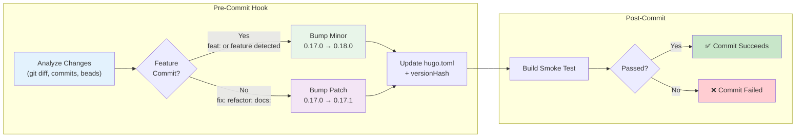
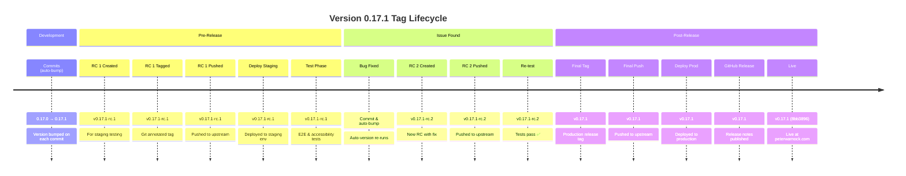

# Release Workflow

Three-stage release process: Pre-Release → Test → Production Release

## Process Diagram

```mermaid
graph TB
    subgraph "Development"
        Commits["Make Commits<br/>(auto-version bumps)"]
        Check["./scripts/release.sh check"]
    end

    subgraph "Stage 1: Pre-Release"
        PreRelease["./scripts/release.sh pre<br/>Creates v0.17.1-rc.1"]
        PushRC["FORCE_PUSH=yes<br/>git push upstream v0.17.1-rc.1"]
        DeployStaging["bun run deploy:staging"]
    end

    subgraph "Stage 2: Testing"
        TestE2E["bun run test:e2e"]
        TestAccess["bun run test:accessibility"]
        TestPass{Tests Pass?}
    end

    subgraph "Stage 3: Post-Release"
        PostRelease["./scripts/release.sh post<br/>Creates v0.17.1"]
        PushFinal["FORCE_PUSH=yes<br/>git push upstream main v0.17.1"]
        DeployProd["bun run deploy:production"]
        GitHubRelease["Create GitHub Release"]
    end

    subgraph "Live"
        Live["Live at peterwarnock.com<br/>v0.17.1 8bb3896"]
    end

    Commits --> Check
    Check --> PreRelease
    PreRelease --> PushRC
    PushRC --> DeployStaging
    DeployStaging --> TestE2E
    TestE2E --> TestAccess
    TestAccess --> TestPass
    TestPass -->|❌ Fail| FixBug["Fix Bug & Commit<br/>Pre-Release Repeats"]
    FixBug --> Check
    TestPass -->|✅ Pass| PostRelease
    PostRelease --> PushFinal
    PushFinal --> DeployProd
    DeployProd --> GitHubRelease
    GitHubRelease --> Live

    style Commits fill:#e1f5ff
    style PreRelease fill:#fff3e0
    style TestE2E fill:#fff3e0
    style TestPass fill:#fff3e0
    style PostRelease fill:#e8f5e9
    style DeployProd fill:#e8f5e9
    style Live fill:#c8e6c9
```

## Quick Reference

```bash
# Check current release status
./scripts/release.sh check

# Stage 1: Create pre-release tag (for testing)
./scripts/release.sh pre        # Creates v0.17.1-rc.1

# Stage 2: Push to production (after testing passes)
./scripts/release.sh post       # Creates v0.17.1
```

## Auto-Versioning Diagram



## Release Stages

### Stage 1: Pre-Release (RC Tag)

When ready to test a version before production:

```bash
# Create release candidate tag
./scripts/release.sh pre

# Output example:
# Creating pre-release tag...
# Version: 0.17.1
# RC Tag: v0.17.1-rc.1
# ✅ Created v0.17.1-rc.1
```

**What this does:**

- Creates annotated git tag `v0.17.1-rc.1`
- Records RC metadata (version, branch, commit, date)
- Allows multiple RCs: rc.1, rc.2, rc.3, etc.

**Next steps:**

```bash
# Push RC tag to upstream
FORCE_PUSH=yes git push upstream v0.17.1-rc.1

# Deploy to staging environment
bun run deploy:staging

# Run full test suite
bun run test:e2e
bun run test:accessibility
```

### Stage 2: Production Release

After RC testing passes and you're ready to go live:

```bash
# Create production release tag
./scripts/release.sh post

# Output example:
# Creating production release tag...
# Version: 0.17.1
# Release Tag: v0.17.1
# ✅ Created v0.17.1
```

**What this does:**

- Creates annotated git tag `v0.17.1` (without RC suffix)
- Records production metadata
- Marks version as officially released
- Prevents accidental RC re-creation

**Next steps:**

```bash
# Push production tag to upstream
FORCE_PUSH=yes git push upstream v0.17.1

# Deploy to production
bun run deploy:production

# Create GitHub Release from the tag
# - Copy release notes
# - Attach any artifacts
# - Mark as latest release
```

## Tag Lifecycle Diagram



## Why Three Stages?

```
PRE-RELEASE (RC)          PRODUCTION (FINAL)
─────────────────────────────────────────
v0.17.1-rc.1 (staging)   v0.17.1 (live)
     ↓
   test
     ↓
  v0.17.1-rc.2 (if needed)
     ↓
   retest
     ↓
  PASS → v0.17.1 (production)
```

**Benefits:**

- Test exact code before production push
- Multiple RC iterations if needed
- Clear marker of what's live vs testing
- Easy rollback: revert to previous tag
- Semantic versioning compliance

## Common Scenarios

### Multiple RCs Before Release

```bash
# First RC test found issues
./scripts/release.sh pre     # Creates v0.17.1-rc.1
FORCE_PUSH=yes git push upstream v0.17.1-rc.1
bun run deploy:staging && bun run test:e2e
# ❌ Test failed

# Fix the issue and commit
git commit -am "fix: address test failure"

# Create new RC
./scripts/release.sh pre     # Creates v0.17.1-rc.2
FORCE_PUSH=yes git push upstream v0.17.1-rc.2
bun run deploy:staging && bun run test:e2e
# ✅ All tests pass

# Release to production
./scripts/release.sh post    # Creates v0.17.1
FORCE_PUSH=yes git push upstream v0.17.1
bun run deploy:production
```

### Skip RC (Emergency Hotfix)

If you need to skip RC testing (not recommended):

```bash
./scripts/release.sh post

# Script will warn:
# ⚠️  No RC tags found for this version
# Create release without RC testing? (y/N):

# Type 'y' only for urgent hotfixes
```

### Check Version Status

At any time, check where you are in the release cycle:

```bash
./scripts/release.sh check

# Output:
# Release Status
# ═══════════════════════════════════════
# Current version: 0.17.1
# Latest release tag: v0.17.1
#
# ✅ v0.17.1 is RELEASED
#
# Recent tags:
#   v0.17.1      (production)
#   v0.17.1-rc.1 (previous RC)
#   v0.16.0      (previous release)
```

## Integration with Auto-Versioning

The auto-version pre-commit hook bumps versions:

```
commits → auto-bump version → pre-release RC → test → post-release final
```

**Example flow:**

1. Make 3 commits (patches) → version auto-bumps from v0.17.0 to v0.17.3
2. Create RC: `./scripts/release.sh pre` → v0.17.3-rc.1
3. Test in staging
4. Release: `./scripts/release.sh post` → v0.17.3

## Tag Naming Convention

- **Production releases**: `v0.17.1` (semantic version only)
- **Release candidates**: `v0.17.1-rc.1` (with RC suffix)
- **Hotfixes**: `v0.17.1-hotfix` (if needed for patches)

## Troubleshooting

### "Version already released" error

```bash
./scripts/release.sh post
# ❌ Version v0.17.1 is already released!

# Solution: Bump version in hugo.toml before releasing
```

### Tag push fails

```bash
FORCE_PUSH=yes git push upstream v0.17.1
# error: src refspec v0.17.1 does not match any

# Solution: Tag may have been lost in pre-push hook
# Recreate with: ./scripts/release.sh post
```

### Accidental RC tag

```bash
# Delete local tag
git tag -d v0.17.1-rc.1

# Delete remote tag
git push upstream :refs/tags/v0.17.1-rc.1

# Recreate the correct one
./scripts/release.sh pre
```

## GitHub Release Creation

After pushing the production tag:

1. Go to [Releases](https://github.com/pwarnock/pwarnock.github.io/releases)
2. Click "Create a new release"
3. Select the `v0.17.1` tag
4. Add release notes:
   - **Title**: v0.17.1: [Feature Summary]
   - **Body**: Copy from `.cody/project/build/v0.17.1/release-notes.md`
5. Attach any artifacts (build logs, etc.)
6. Mark as "Latest release"
7. Publish

## CI/CD Integration

The project uses **path-based build control** via `path-based-builds.yml`, which intelligently routes changes based on what was modified.

### Path-Based Deployment Logic

Different types of changes trigger different build and deployment strategies:

| Change Type       | Examples                                  | Build | Test | Deploy               |
| ----------------- | ----------------------------------------- | ----- | ---- | -------------------- |
| **Content**       | `content/`, `static/`, `assets/`, `data/` | ✅    | ✅   | ✅ Production        |
| **Build Config**  | `hugo.toml`, `layouts/`, `config/`, deps  | ✅    | ✅   | ✅ Production        |
| **Test-Only**     | `test/`, `tests/`, `scripts/`, `.github/` | ✅    | ✅   | ❌ Verification only |
| **Documentation** | `docs/`, `*.md`                           | ❌    | ❌   | ❌ Validation only   |

### Build Behaviors

**Content or Build Config changes:**

- Fast or comprehensive build depending on scope
- Code quality & security scanning
- Full test suite validation
- Automatic deployment to production on main branch
- Version auto-bumped on commit

**Test-only changes:**

- Full build and test validation runs
- Security scanning and linting included
- No automatic deployment (safe for infrastructure/test changes)
- Useful for verifying CI/CD workflows before release

**Documentation-only changes:**

- Lightweight markdown validation
- No Hugo build required
- No deployment
- Minimal CI resource usage

**Combined changes (e.g., content + build config):**

- Both build processes run simultaneously
- Both must pass before deployment
- Single deployment to production

### Workflow Files

- **Primary**: `.github/workflows/path-based-builds.yml` - All CI/CD logic (consolidated)
- **Related**: `.github/workflows/coverage.yml` - Code coverage tracking (skips docs-only)
- **Related**: `.github/workflows/test.yml` - Hugo build validation (skips docs-only)

### Why Path-Based Logic?

- **Efficiency**: Docs-only changes skip expensive builds
- **Safety**: Test changes build/test but don't deploy
- **Simplicity**: Single source of truth for CI/CD decisions
- **Parallelism**: Content and build config changes deploy simultaneously when both occur

## See Also

- [RELEASE_MANAGEMENT.md](./RELEASE_MANAGEMENT.md) - Deployment procedures
- [AGENTS.md](../../AGENTS.md) - Version bumping automation
- [Beads issue tracking](../../README.md#issue-tracking) - Track release blockers
